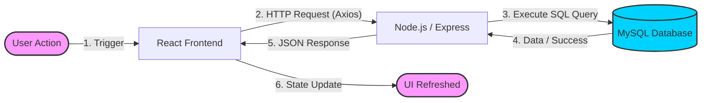

# 🔄 System Architecture & Data Flow

This document provides a simple overview of how every action (like adding a student or marking attendance) travels through the **Student DBMS** application.

---

## ⚡ The Action Lifecycle (Visual)

---

## 🛠️ Step-by-Step Breakdown

### 1. 🖱️ Client-Side Interaction
The process starts in the **React Frontend** (`frontend/src/pages/`). When you fill a form and click a button (e.g., **INSERT**), the data is captured and validated in the component state.

### 2. 🌐 API Communication
The frontend uses **Axios** (`frontend/src/utils/api.js`) to send an asynchronous network request. The data is bundled into **JSON format** and sent to the backend server's endpoint.

### 3. 🧠 Server-Side Processing
The **Node.js/Express** backend (`backend/routes/api.js`) receives the request. The **Controller** logic extracts the data and prepares it for the database.

### 4. 🗄️ Database Persistence
The backend communicates with **MySQL** using the `mysql2` driver. It runs the **Raw SQL Query** (like `INSERT`, `SELECT`, or `DELETE`). The database engine processes the command and permanently stores the data.

### 5. 🔄 UI Synchronization
Once the database is updated, the server sends a "Success" response back. The React frontend receives this and instantly updates the UI, ensuring the new data is visible without needing a page refresh.

---

## 🏗️ Technology Stack

| Component | Technology | Role |
| :--- | :--- | :--- |
| **Frontend** | React.js | Visual Interface & Interaction |
| **API Client** | Axios | Network Communication |
| **Backend** | Node.js / Express | Logic & Routing |
| **Database** | MySQL | Persistent Storage |
| **Interface** | Raw SQL | Precise DB Communication |

